# SafeLink

SafeLink é um aplicativo Android nativo de segurança preventiva contra links suspeitos, phishing e golpes digitais. Ele ajuda o usuário a revisar um destino antes de abrir, combinando análise local de URL, interceptação por intents do Android, monitoramento opcional por acessibilidade e uma camada opcional de VPN local para bloqueio DNS.

O objetivo do projeto é colocar uma etapa clara de decisão entre o clique e o destino final sempre que o Android permitir a interceptação. A tela de revisão mostra o nível de risco, os motivos da classificação e ações diretas para cancelar, copiar, confiar, bloquear ou continuar.

## Destaques

- Aplicativo Android nativo escrito em Kotlin.
- Interface em Jetpack Compose com Material 3.
- Análise local de URLs sem dependência obrigatória de backend.
- Interceptação de links HTTP/HTTPS por fluxo de navegador ou app padrão.
- Suporte a compartilhamento de links recebidos de outros aplicativos.
- Analisador manual para links e domínios colados pelo usuário.
- Histórico local com decisões, pontuação de risco, ocorrências e detalhes.
- Listas locais de domínios confiáveis e bloqueados.
- Monitoramento opcional via `AccessibilityService`.
- Bloqueio DNS opcional via `VpnService` local.
- Flavors `full` e `lite`.
- Testes unitários para o motor de análise de URL.

## Apresentação da Interface

Esta área apresenta capturas reais da interface do aplicativo, organizadas para mostrar as principais telas e fluxos do SafeLink.

### 1. Dashboard e Graficos

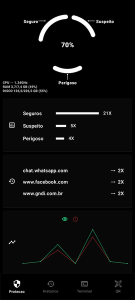

A tela inicial apresenta o estado geral da proteção do SafeLink, destacando informações gerais do aplicativo e suas funcionalidades, com o objetivo de resumir e apresentar o comportamento atual.
Dashboard: Apresenta uma interface limpa e de fácil compreensão, exibindo de forma imediata o estado de cada categoria de análise: Seguro, Suspeito e Perigoso. Dessa forma, o usuário consegue visualizar rapidamente qual status predomina no cenário monitorado, facilitando a análise da situação e a tomada de decisões relacionadas à segurança.
Gráfico Auxiliar: Exibe a frequência de resultados gerados pelas análises, agrupados por categoria de status. Essa representação gráfica facilita a interpretação dos dados e o acompanhamento da incidência de eventos classificados como Seguro, Suspeito ou Perigoso.
Indicador: Apresenta, em ordem de recorrência, os três links mais frequentemente analisados. Essa informação permite ao usuário obter uma percepção mais clara de seus hábitos de navegação e das ações realizadas ao longo do tempo.
Gráfico em Linhas: Apresenta ao usuário o histórico semanal da relação entre links analisados e links bloqueados. Essa visualização permite acompanhar a evolução das atividades ao longo do tempo, proporcionando uma percepção mais ampla sobre os hábitos de navegação, a efetividade das análises realizadas e o funcionamento dos mecanismos de proteção do aplicativo.


### 2. Cartão Central de Proteção

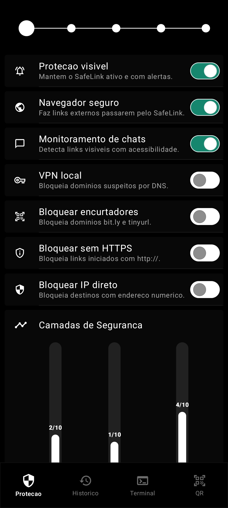

Esta área concentra o status de proteção em tempo real, permitindo que o usuário compreenda rapidamente se o aplicativo está pronto para analisar links e reduzir riscos durante a navegação. Além disso, possibilita a configuração do aplicativo de acordo com as permissões concedidas pelo usuário.
Por meio do gráfico de Camadas de Segurança, é apresentado em tempo real o nível de proteção de cada perfil disponível: Rígido, Silencioso e Personalizado. O usuário pode alternar rapidamente entre as configurações predefinidas ou criar sua própria configuração por meio de um controle dedicado, sendo constantemente informado sobre o nível de segurança atualmente aplicado.

### 3. Histórico de Análises

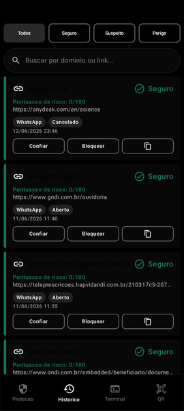

O aplicativo é estruturado com uma área dedicada ao histórico de links analisados. Para cada link, são apresentadas informações detalhadas sobre seu status de segurança, permitindo que o usuário acompanhe os resultados das análises ja realizadas.
Além disso, o sistema disponibiliza opções de interação e gerenciamento para cada registro, como Confiar, Bloquear, Copiar, Excluir e Analisar, oferecendo ao usuário maior controle sobre os links armazenados e suas respectivas classificações.

### 4. Interação Detalhes do Link pelo Histórico

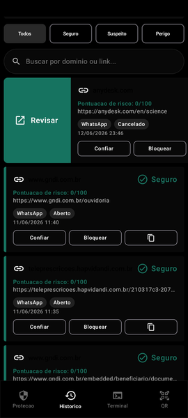

Ao selecionar um link e arrastar o card para a esquerda, o usuário tem acesso aos detalhes da sua decisão, incluindo a linha do tempo e os motivos da análise, em uma única viewport. O usuário também pode retornar ao histórico a qualquer momento.

### 5. Interação Excluir o Link pelo Histórico

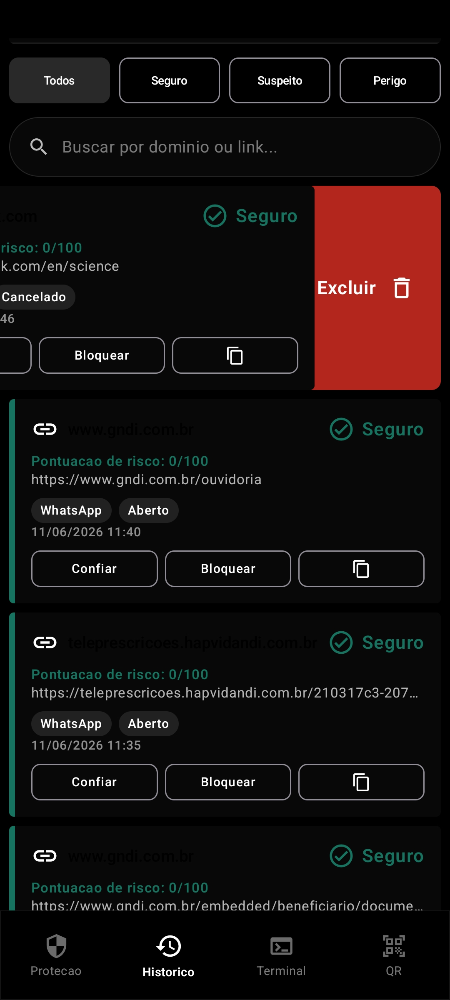

Ao selecionar um link e arrastar o card para a direita, o usuário tem controle de excluir permanentemente o link do histórico local. O usuário também pode retornar ao histórico a qualquer momento.

### 6. Painel Terminal Interno

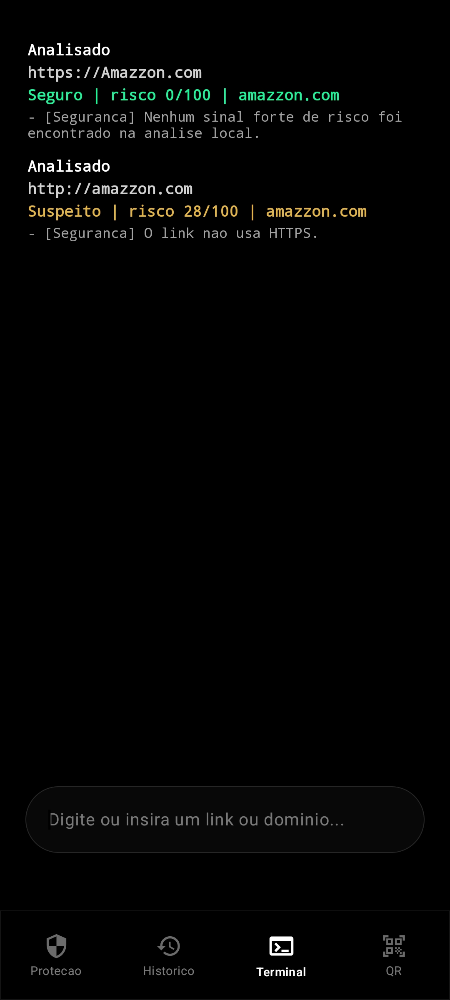

O painel terminal oferece uma forma mais direta de inserir comandos, links e domínios, criando uma experiência técnica para testes e gerenciamento rápido. O módulo de gerenciamento manual de links e domínios, permite a aplicação de ações como bloquear, desbloquear, confiar, analisar ou reanalisar um determinado endereço.

### 7. Analisador Manual

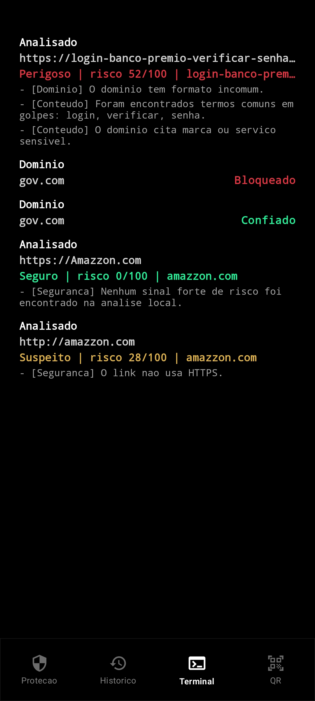

O analisador manual possibilita a inserção de links ou domínios para avaliação imediata, retornando uma classificação local que auxilia o usuário na decisão de abrir ou bloquear o destino.

### 8. Aviso Seguro

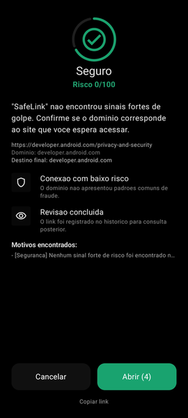

Ao capturar um link por meio de interação do usuário ou varredura automática, o aplicativo interrompe a ação primária para iniciar o processo de análise. Após a avaliação, é gerado um status de segurança exibido em formato de alerta, contendo os detalhes do link analisado. O sistema então retorna a classificação do link com seu respectivo nível de risco.

### 9. Aviso de Perigo

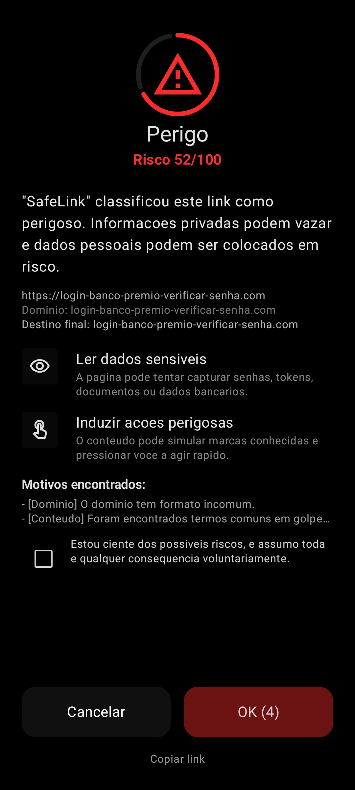

Passando pelo mesmo sistema de interrupção e análise, quando um link apresenta fortes indícios de golpe ou phishing, o SafeLink destaca o risco por meio de uma interface de alerta clara, explicando os motivos antes de qualquer abertura externa. Dessa forma, o usuário pode decidir conscientemente se deseja prosseguir ou cancelar a ação.

### 10. Analise inteligente
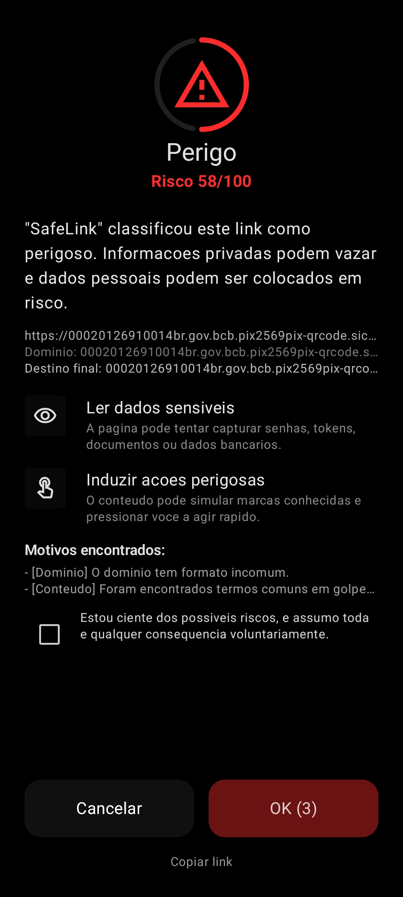

O SafeLink integra diferentes mecanismos do Android para ampliar sua cobertura, incluindo navegador padrão, compartilhamento de conteúdo, serviços de acessibilidade e VPN local. Com base em um conjunto de regras e análises voltadas à detecção de atividades maliciosas, o aplicativo identifica potenciais ameaças a partir de links e classifica seu nível de risco, gerando alertas de segurança correspondentes a cada cenário.

### 11. Alerta Suspeito

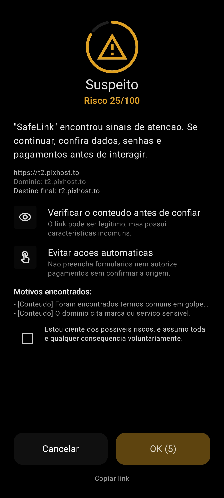

O alerta de suspeita também passa por um sistema inteligente de pré-decisão, no qual o aplicativo distingue níveis intermediários de risco, separando situações perigosas de situações apenas suspeitas. Isso ocorre porque nem todos os links apresentam comportamento claramente seguro ou malicioso, sendo alguns apenas potencialmente arriscados e exigindo atenção do usuário. Dessa forma, o usuário recebe um alerta mais específico e contextualizado.

### 12. Notificações

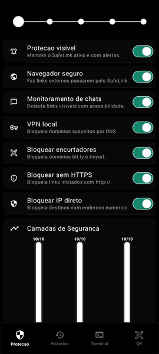

Com a permissão do usuário, enquanto estiver em funcionamento, o aplicativo notifica o usuário sobre qualquer análise realizada, informando-o para que possa tomar uma decisão, quando necessário.

## Escopo Atual

O SafeLink foca em reduzir o risco antes da abertura de links em dispositivos Android. Ele não substitui o modelo de segurança do Android, o isolamento do navegador, antivírus ou o julgamento do usuário.

Implementado na versão atual:

- Dashboard principal do SafeLink.
- Tela de revisão de links.
- Entrada como navegador seguro.
- Motor local de pontuação de URL.
- Serviço de proteção em foreground.
- Monitoramento opcional por acessibilidade.
- VPN local opcional para bloqueio DNS.
- Histórico e telas de detalhe.
- Exportação e backup de listas gerenciadas pelo usuário.
- Documentação técnica em `docs/`.

Fora do escopo desta versão:

- Sincronização em nuvem.
- Contas de usuário.
- API remota de reputação.
- Dashboard web.
- Pipeline de publicação na Play Store.

## Stack Técnica

- Kotlin
- Android Gradle Plugin
- Jetpack Compose
- Material 3
- AndroidX Core KTX
- Lifecycle Runtime
- Navigation Compose como dependência disponível
- SharedPreferences e persistência em JSON
- JUnit 4
- Robolectric
- Java 17

## Estrutura do Projeto

```text
.
|-- app/
|   |-- build.gradle.kts
|   `-- src/
|       |-- main/
|       |   |-- AndroidManifest.xml
|       |   |-- assets/
|       |   |-- java/com/safelink/app/
|       |   |   |-- MainActivity.kt
|       |   |   |-- LinkReviewActivity.kt
|       |   |   |-- BrowserEntryActivity.kt
|       |   |   |-- data/
|       |   |   |-- model/
|       |   |   |-- security/
|       |   |   |-- service/
|       |   |   `-- ui/
|       |   `-- res/
|       |-- lite/
|       `-- test/
|-- docs/
|-- gradle/
|-- build.gradle.kts
|-- settings.gradle.kts
`-- README.md
```

## Requisitos

- Android Studio ou instalação compatível do Android SDK.
- JDK 17.
- Gradle Wrapper incluído neste repositório.
- Android SDK Platform 35.

## Como Começar

Clone o repositório:

```bash
git clone https://github.com/fjrsonn/SafeLink.git
cd SafeLink
```

Execute os testes unitários:

```bash
./gradlew testFullDebugUnitTest
```

Gere o APK debug da versão full:

```bash
./gradlew assembleFullDebug
```

Gere o APK debug da versão lite:

```bash
./gradlew assembleLiteDebug
```

No Windows PowerShell, use:

```powershell
.\gradlew.bat testFullDebugUnitTest
.\gradlew.bat assembleFullDebug
```

## Assinatura de Release

As credenciais de assinatura de release não são versionadas. Configure-as localmente por variáveis de ambiente ou pelo arquivo `local.properties`.

Variáveis de ambiente:

```bash
SAFELINK_RELEASE_STORE_FILE=path/to/safelink-release.keystore
SAFELINK_RELEASE_STORE_PASSWORD=sua-senha-do-keystore
SAFELINK_RELEASE_KEY_ALIAS=seu-alias
SAFELINK_RELEASE_KEY_PASSWORD=sua-senha-da-chave
```

Entradas equivalentes em `local.properties`:

```properties
safelink.release.storeFile=dist/safelink-release.keystore
safelink.release.storePassword=sua-senha-do-keystore
safelink.release.keyAlias=seu-alias
safelink.release.keyPassword=sua-senha-da-chave
```

Após configurar a assinatura, gere os artefatos de release:

```bash
./gradlew assembleFullRelease
./gradlew bundleFullRelease
```

APKs, AABs, keystores e saídas locais de build são ignorados pelo Git.

## Como a Análise Funciona

O analisador local atribui pontuação a diferentes sinais de risco:

- Ausência de HTTPS.
- Encurtadores de URL conhecidos.
- Punycode e riscos de domínios internacionalizados.
- Mistura de alfabetos parecidos.
- Domínios longos ou com formato incomum.
- Termos sensíveis comuns em golpes.
- Padrões de domínio que imitam marcas conhecidas.
- Uso direto de endereço IP.

O resultado é mapeado para um nível de risco:

- Seguro
- Suspeito
- Perigoso

Cada resultado inclui uma pontuação e motivos em linguagem clara para que o usuário entenda a decisão antes de continuar.

## Camadas de Proteção no Android

O SafeLink usa múltiplos mecanismos do Android porque nenhum método isolado cobre todos os aplicativos:

- Entrada como navegador ou app padrão: recebe links HTTP/HTTPS quando o Android direciona o fluxo para o SafeLink.
- Compartilhamento: revisa links enviados por outros aplicativos como texto.
- Serviço de acessibilidade: observa opcionalmente textos visíveis e abre a revisão quando detecta uma URL.
- VPN local: aplica bloqueio DNS por domínio com base em políticas locais.

Alguns aplicativos usam navegadores internos, renderizadores privados, DNS próprio, cache ou fluxos que limitam a interceptação. O SafeLink documenta essas limitações em vez de prometer cobertura total.

## Documentação

A pasta `docs/` contém documentação técnica mais profunda, incluindo:

- Visão de produto.
- Requisitos funcionais e não funcionais.
- Arquitetura.
- Fundação Android.
- Motor de interceptação.
- Motor de análise de URL.
- Segurança e privacidade.
- Testes e QA.
- Release e distribuição.
- Roadmap futuro.

Comece por:

- `docs/00_README.md`
- `docs/05_architecture.md`
- `docs/10_interception_engine.md`
- `docs/11_url_analysis_engine.md`
- `docs/16_testing_qa.md`

## Testes

Comando principal:

```bash
./gradlew testFullDebugUnitTest
```

Os testes unitários atuais cobrem casos representativos do analisador:

- Links de phishing com banco, login e senha.
- Links suspeitos que imitam marcas.
- Links encurtados.
- Links HTTP com termos sensíveis.
- Links seguros de documentação.

## Notas de Segurança

- Não versionar keystores de release.
- Não versionar senhas de assinatura.
- Não versionar `local.properties`.
- Tratar APKs e AABs gerados como artefatos de release, não como código-fonte.
- Revisar permissões e comportamento dos serviços Android antes de distribuir.

## Licença

Nenhum arquivo de licença foi incluído até o momento. Adicione uma licença antes de distribuir o projeto ou aceitar contribuições externas.
